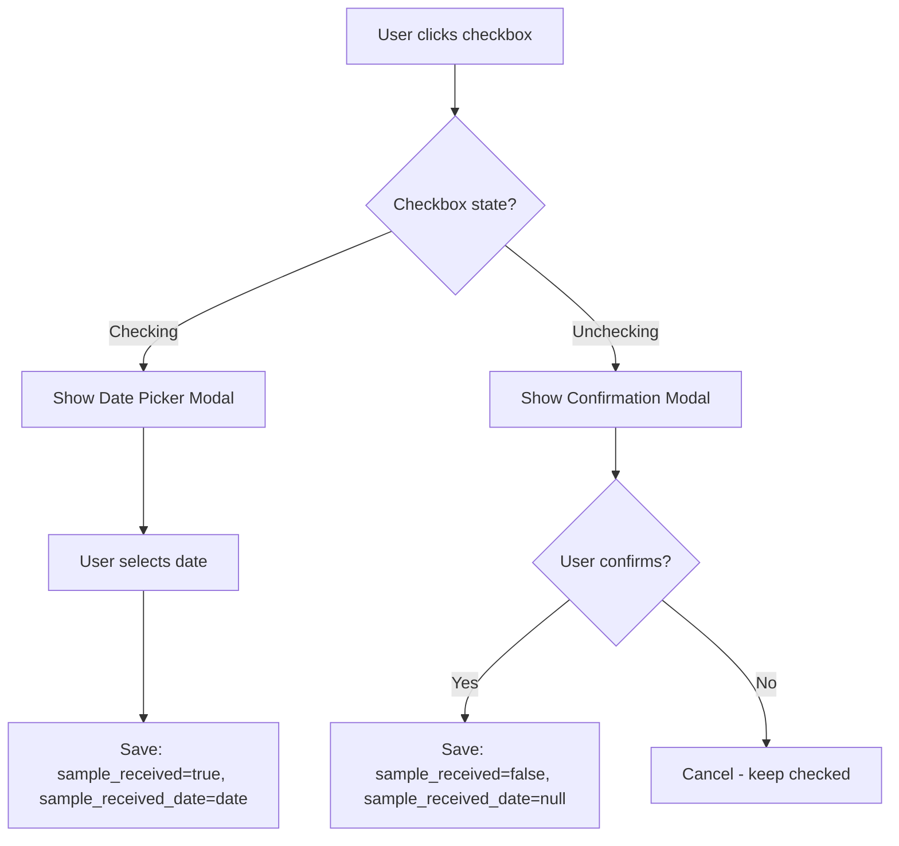
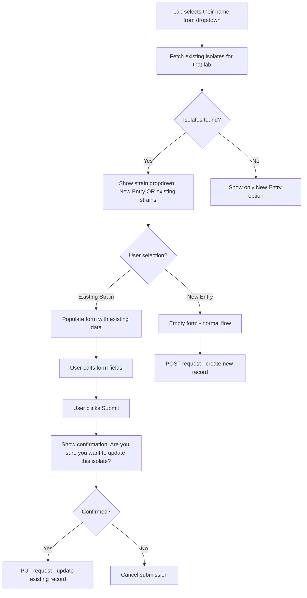
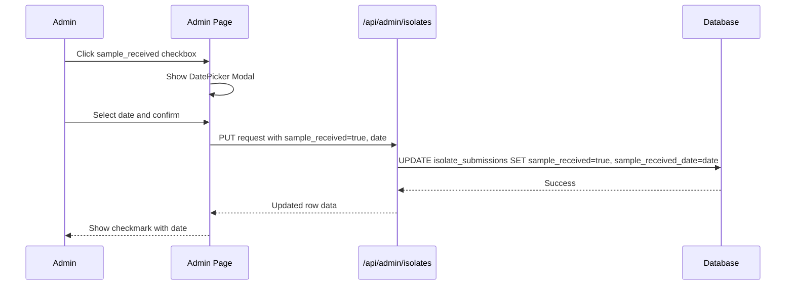
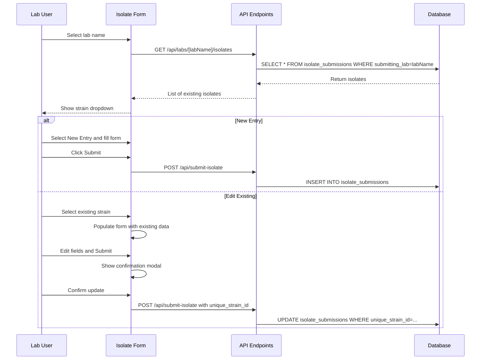

# Implementation Plan: Sample Tracking & Isolate Edit Features

## Overview

This plan covers two related features:
1. **Admin Sample Received Tracking** - Track when physical samples arrive at the lab
2. **Isolate Form Edit Mode** - Allow labs to edit existing isolate submissions

---

## Feature 1: Admin Sample Received Checkbox

### Purpose
Enable administrators to track whether a physical sample has been received after a lab indicates they are sending one.

### Database Changes

```sql
-- Add new columns to isolate_submissions table
ALTER TABLE isolate_submissions
ADD COLUMN sample_received BOOLEAN DEFAULT FALSE,
ADD COLUMN sample_received_date DATE,
ADD COLUMN unique_strain_id VARCHAR(255);

-- Update existing records with unique_strain_id
UPDATE isolate_submissions 
SET unique_strain_id = strain_name || '__' || submitting_lab
WHERE unique_strain_id IS NULL;
```

### Component Changes

#### 1. EditableTable Component Enhancement

Add a new column type `checkbox` that:
- Renders as a checkbox in both view and edit modes
- When checked, triggers a date picker popup
- When unchecked, shows confirmation dialog



#### 2. Files to Modify

| File | Changes |
|------|---------|
| [`src/components/EditableTable.tsx`](src/components/EditableTable.tsx) | Add checkbox column type with popup logic |
| [`src/app/admin/page.tsx`](src/app/admin/page.tsx) | Add new columns to isolateColumns array, update IsolateData interface |
| [`src/app/api/admin/isolates/route.ts`](src/app/api/admin/isolates/route.ts) | Handle new fields in PUT request |

#### 3. New UI Components Needed

**DatePickerModal** - A modal that appears when checking the received checkbox:
- Title: "Sample Received"
- Date input field with today as default
- Save/Cancel buttons

**ConfirmationModal** - A modal that appears when unchecking:
- Message: "Are you sure you want to mark this sample as not received?"
- Yes/No buttons

### Admin Page Column Definition

```typescript
const isolateColumns: Column[] = [
  // ... existing columns ...
  { 
    key: 'sample_received', 
    header: 'Received?', 
    type: 'checkbox',
    onCheck: 'showDatePicker',  // Custom handler
  },
  { 
    key: 'sample_received_date', 
    header: 'Date Received', 
    type: 'date',
    readonly: true  // Only set via checkbox interaction
  },
  { key: 'unique_strain_id', header: 'Unique ID', readonly: true },
];
```

---

## Feature 2: Isolate Form Edit Mode

### Purpose
Allow participating labs to edit existing isolate submissions rather than creating duplicates.

### Workflow



### Database Changes

The `unique_strain_id` column serves as a composite key:
- Format: `{strain_name}__{lab_name}`
- Example: `CEA17__Smith Lab`
- Used to identify and update existing records

### API Changes

#### 1. New Endpoint: Get Isolates by Lab

**File:** [`src/app/api/labs/[labName]/isolates/route.ts`](src/app/api/labs/%5BlabName%5D/isolates/route.ts) (new file)

```typescript
// GET /api/labs/[labName]/isolates
// Returns all isolates submitted by a specific lab
export async function GET(
  request: NextRequest,
  { params }: { params: { labName: string } }
) {
  const sql = neon(process.env.POSTGRES_URL!);
  const isolates = await sql`
    SELECT * FROM isolate_submissions 
    WHERE submitting_lab = ${decodeURIComponent(params.labName)}
    ORDER BY timestamp DESC
  `;
  return NextResponse.json({ isolates });
}
```

#### 2. Modify Submit Isolate Endpoint

**File:** [`src/app/api/submit-isolate/route.ts`](src/app/api/submit-isolate/route.ts)

Add logic to:
1. Generate `unique_strain_id` from strain_name + lab_name
2. Check if isolate with that unique_strain_id exists
3. If exists: UPDATE, if not: INSERT

```typescript
// Generate unique strain ID
const unique_strain_id = `${data.strain_name}__${data.submitting_lab}`;

// Check for existing record
const existing = await sql`
  SELECT id FROM isolate_submissions 
  WHERE unique_strain_id = ${unique_strain_id}
`;

if (existing.length > 0) {
  // UPDATE existing record
  await sql`UPDATE isolate_submissions SET ... WHERE unique_strain_id = ${unique_strain_id}`;
} else {
  // INSERT new record
  await sql`INSERT INTO isolate_submissions ...`;
}
```

### Isolate Form Changes

#### Files to Modify

| File | Changes |
|------|---------|
| [`src/app/isolate-form/page.tsx`](src/app/isolate-form/page.tsx) | Add strain selection dropdown, fetch existing isolates, populate form, add confirmation modal |

#### State Changes

```typescript
// New state variables
const [existingIsolates, setExistingIsolates] = useState<ExistingIsolate[]>([]);
const [selectedIsolateId, setSelectedIsolateId] = useState<string | null>(null);
const [isEditMode, setIsEditMode] = useState(false);
const [showOverwriteConfirm, setShowOverwriteConfirm] = useState(false);
```

#### UI Changes

After lab selection, show a new dropdown:

```tsx
{formData.submitting_lab && (
  <div>
    <label>Strain Name/ID *</label>
    <select onChange={handleStrainSelection}>
      <option value="new">-- Enter New Strain --</option>
      {existingIsolates.map(isolate => (
        <option key={isolate.id} value={isolate.unique_strain_id}>
          {isolate.strain_name} (existing)
        </option>
      ))}
    </select>
    {!selectedIsolateId && (
      <input 
        type="text"
        placeholder="Enter new strain name"
        value={formData.strain_name}
        onChange={...}
      />
    )}
  </div>
)}
```

#### Confirmation Modal for Updates

```tsx
{showOverwriteConfirm && (
  <div className="modal">
    <h3>Update Existing Isolate?</h3>
    <p>You are about to update the data for strain {formData.strain_name}. 
       This will overwrite the existing record.</p>
    <button onClick={confirmUpdate}>Yes, Update</button>
    <button onClick={cancelUpdate}>Cancel</button>
  </div>
)}
```

---

## Implementation Order

### Phase 1: Database Setup
1. Run database migration to add new columns
2. Backfill `unique_strain_id` for existing records

### Phase 2: Admin Page - Sample Tracking
1. Extend EditableTable with checkbox column type
2. Create DatePickerModal component
3. Create ConfirmationModal component
4. Update admin page with new columns
5. Update API routes to handle new fields

### Phase 3: Isolate Form - Edit Mode
1. Create new API endpoint for fetching lab isolates
2. Modify isolate form to fetch existing isolates on lab selection
3. Add strain selection dropdown
4. Implement form population for existing strains
5. Add overwrite confirmation modal
6. Modify submit endpoint to handle updates

### Phase 4: Testing
1. Test admin checkbox flow - check with date, uncheck with confirmation
2. Test isolate form - new entry creation
3. Test isolate form - existing entry selection and population
4. Test isolate form - update with confirmation
5. Verify unique_strain_id generation works correctly

---

## Data Flow Diagrams

### Admin Sample Tracking Flow



### Isolate Form Edit Flow



---

## Questions to Clarify

1. ✅ **Checkbox with date popup** - Confirmed: when checked, show date picker
2. ✅ **Reversible marking** - Confirmed: show "Are you sure?" before unmarking
3. ✅ **Warning before overwrite** - Confirmed: show warning before updating existing isolate
4. ✅ **Unique strain ID format** - Confirmed: `{strain_name}__{lab_name}`
5. ✅ **Implement together** - Confirmed: both features in single implementation

---

## Files Summary

### New Files
- [`src/app/api/labs/[labName]/isolates/route.ts`](src/app/api/labs/%5BlabName%5D/isolates/route.ts) - API for fetching lab-specific isolates

### Modified Files
- [`src/components/EditableTable.tsx`](src/components/EditableTable.tsx) - Add checkbox type with modal support
- [`src/app/admin/page.tsx`](src/app/admin/page.tsx) - Add new columns, update interfaces
- [`src/app/api/admin/isolates/route.ts`](src/app/api/admin/isolates/route.ts) - Handle new fields
- [`src/app/isolate-form/page.tsx`](src/app/isolate-form/page.tsx) - Add edit mode functionality
- [`src/app/api/submit-isolate/route.ts`](src/app/api/submit-isolate/route.ts) - Handle updates vs inserts

### Database Migration
- New SQL migration script for adding columns
